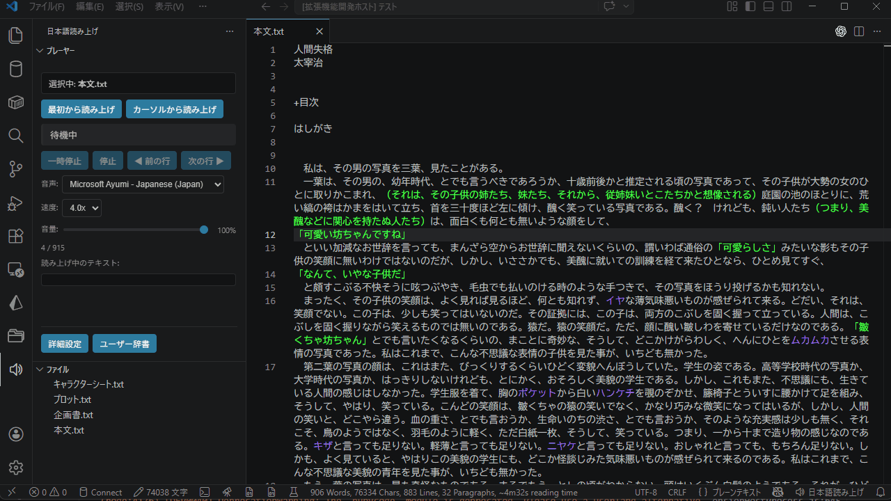
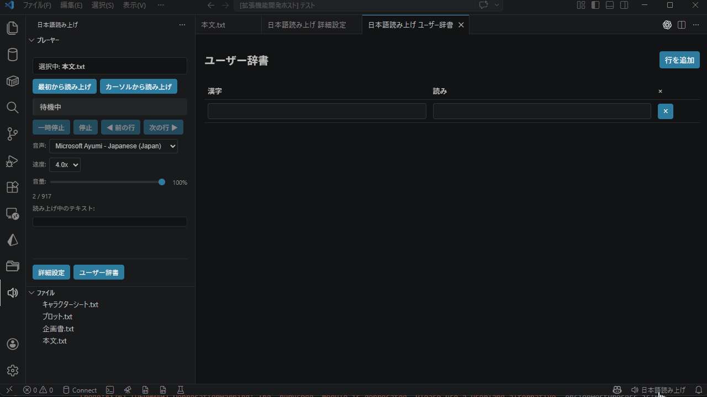
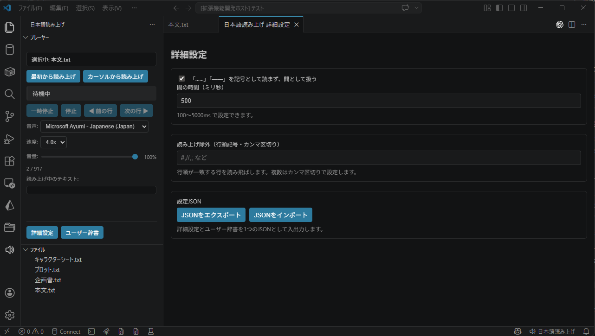

# 日本語読み上げ

テキストファイルの内容を日本語で読み上げる VS Code 拡張機能です。Windows / macOS / Linux に対応し、日本語音声と Web Speech API が利用できる環境で動作します。  
A VS Code extension that reads text files aloud in Japanese. It supports Windows, macOS, and Linux, and works in environments where Japanese voices and the Web Speech API are available.

---

## 機能 / Features

### 基本操作

- **ファイル読み上げ** — サイドバーのファイルエクスプローラーからファイルを選択して読み上げ
- **カーソル位置から読み上げ** — エディタ上のカーソル位置がある行から読み上げ開始
- **一時停止 / 再開 / 停止** — 読み上げ中にリアルタイムで制御可能
- **前の行 / 次の行** — 読み上げ位置をボタンで移動

### 音声コントロール

- **音声選択** — OS にインストールされた日本語音声から選択可能
- **速度調整** — 1.0x / 2.0x / 3.0x / 4.0x / 5.0x の 5 段階
- **音量調整** — スライダーで 0〜100% を無段階に調整
- **設定の自動保存** — 音声・速度・音量は変更時に自動保存され、次回起動時に復元

### 読み上げ精度

- **漢字の読み補正** — kuromoji.js による形態素解析で漢字をカタカナに変換
- **ユーザー辞書** — 漢字と読みを表形式で登録。登録語は読み上げ時に自動で置換
- **URL・メールアドレス・単位の読み替え** — `https://...` → 「リンク」など自動変換

### 詳細設定

- **「……」「――」を間（ま）として扱う** — 記号を読まず、指定時間（ms）だけ無音にする
- **読み上げ除外設定** — 行頭の記号（例: `#`, `//`）をカンマ区切りで複数指定。一致した行は読み飛ばす

### 設定の移行

- **JSON エクスポート / インポート** — 詳細設定・ユーザー辞書・プレイヤー設定を 1 つの JSON ファイルで持ち出し可能。端末の移行に対応

### その他

- **オフライン動作** — インターネット接続不要

---

## 使い方 / Usage

1. サイドバーの **日本語読み上げ** アイコンをクリック
2. **ファイル** パネルから読み上げたいファイルを選択
3. **プレーヤー** パネルの「最初から読み上げ」または「カーソルから読み上げ」をクリック

### ユーザー辞書の登録

1. プレーヤー下部の「ユーザー辞書」ボタンをクリック
2. 「行を追加」で行を追加し、漢字と読みを入力
3. 入力内容は自動保存されます。× ボタンで削除

### 詳細設定の変更

1. プレーヤー下部の「詳細設定」ボタンをクリック
2. 各設定を変更すると自動保存されます
3. 「JSON をエクスポート」で設定をファイルに書き出し、別端末では「JSON をインポート」で復元

### キーボードショートカット

| コマンド | ショートカット |
|---|---|
| ファイル全体を読み上げ | `Ctrl+Alt+R` |
| カーソル位置から読み上げ | `Ctrl+Alt+Shift+R` |
| 一時停止 / 再開 | `Ctrl+Alt+P` |
| 停止 | `Ctrl+Alt+S` |

### コマンドパレット

`Ctrl+Shift+P` で以下のコマンドが利用できます:

| コマンド | 説明 |
|---|---|
| `日本語読み上げ: ファイル全体を読み上げ` | アクティブなエディタのファイルを先頭から読み上げ |
| `日本語読み上げ: カーソル位置から読み上げ` | カーソル行から読み上げ開始 |
| `日本語読み上げ: 一時停止/再開` | 読み上げのトグル |
| `日本語読み上げ: 停止` | 読み上げを停止 |
| `日本語読み上げ: 読み上げ速度を設定` | 速度を選択 |
| `日本語読み上げ: 詳細設定を開く` | 詳細設定パネルを開く |
| `日本語読み上げ: ユーザー辞書を開く` | ユーザー辞書パネルを開く |

---

## 動作要件 / Requirements

- Windows / macOS / Linux
- 日本語音声がインストールされ、Web Speech API に対応した VS Code 環境

---

## ライセンス / License

GPL v3
